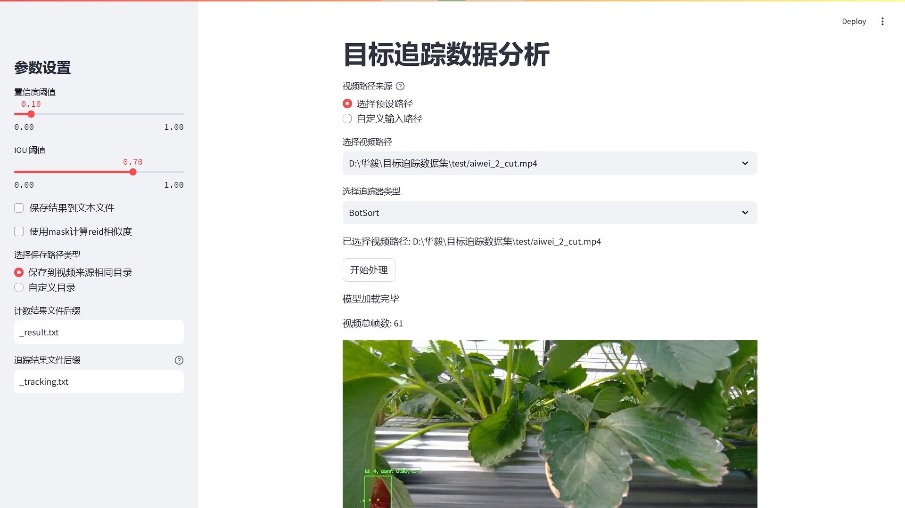

# BoxMOT-hhy: Track project for strawberry count

<div align="center">
  <p>
  
  </p>
</div>

## Introduction

Track project for strawberry count(YOLO+BOTSORT)
TODO:more detail

- analyse 输出分析
- mask 掩码相关处理
- log 读取保存输出日志（用于分析）
- save_txt_video.py yolo+botsort处理视频，生成txt结果
- video2txt_mask_reid.py 逐帧处理视频，生成txt结果
- video2txt_savevideo.py 逐帧处理视频，生成txt结果，并保存结果视频
- track_streamlit.py 结合streamlit的前端页面，可选择视频及参数进行追踪
- gt2txt.py 利用真值生成追踪结果

## Installation

Start with [**Python>=3.9**](https://www.python.org/) environment.

If you want to run the YOLOv8, YOLOv9 or YOLOv10 examples:

```
git clone https://github.com/huanghany/boxmot.git
cd boxmot
pip install poetry
poetry install --with yolo  # installed boxmot + yolo dependencies
poetry shell  # activates the newly created environment with the installed dependencies
```

but if you only want to import the tracking modules you can simply:

```
pip install boxmot
```

## YOLOv8 | YOLOv9 | YOLOv10 examples

<details>
<summary>Tracking</summary>

<details>
<summary>Yolo models</summary>

```bash
$ python tracking/track.py --yolo-model yolov10n      # bboxes only
  python tracking/track.py --yolo-model yolov9s       # bboxes only
  python tracking/track.py --yolo-model yolov8n       # bboxes only
                                        yolov8n-seg   # bboxes + segmentation masks
                                        yolov8n-pose  # bboxes + pose estimation

```

</details>

<details>
<summary>Tracking methods</summary>

```bash
$ python tracking/track.py --tracking-method deepocsort
                                             strongsort
                                             ocsort
                                             bytetrack
                                             botsort
                                             imprassoc
```

</details>

<details>
<summary>Tracking sources</summary>

Tracking can be run on most video formats

```bash
$ python tracking/track.py --source 0                               # webcam
                                    img.jpg                         # image
                                    vid.mp4                         # video
                                    path/                           # directory
                                    path/*.jpg                      # glob
                                    'https://youtu.be/Zgi9g1ksQHc'  # YouTube
                                    'rtsp://example.com/media.mp4'  # RTSP, RTMP, HTTP stream
```

</details>

<details>
<summary>Select ReID model</summary>

Some tracking methods combine appearance description and motion in the process of tracking. For those which use
appearance, you can choose a ReID model based on your needs from
this [ReID model zoo](https://kaiyangzhou.github.io/deep-person-reid/MODEL_ZOO). These model can be further optimized
for you needs by
the [reid_export.py](https://github.com/mikel-brostrom/yolo_tracking/blob/master/boxmot/appearance/reid_export.py)
script

```bash
$ python tracking/track.py --source 0 --reid-model lmbn_n_cuhk03_d.pt               # lightweight
                                                   osnet_x0_25_market1501.pt
                                                   mobilenetv2_x1_4_msmt17.engine
                                                   resnet50_msmt17.onnx
                                                   osnet_x1_0_msmt17.pt
                                                   clip_market1501.pt               # heavy
                                                   clip_vehicleid.pt
                                                   ...
```

</details>

<details>
<summary>Filter tracked classes</summary>

By default the tracker tracks all MS COCO classes.

If you want to track a subset of the classes that you model predicts, add their corresponding index after the classes
flag,

```bash
python tracking/track.py --source 0 --yolo-model yolov8s.pt --classes 16 17  # COCO yolov8 model. Track cats and dogs, only
```

[Here](https://tech.amikelive.com/node-718/what-object-categories-labels-are-in-coco-dataset/) is a list of all the
possible objects that a Yolov8 model trained on MS COCO can detect. Notice that the indexing for the classes in this
repo starts at zero

</details>


</details>

<details>
<summary>Evaluation</summary>

Evaluate a combination of detector, tracking method and ReID model on standard MOT dataset or you custom one by

```bash
$ python3 tracking/val.py --benchmark MOT17-mini --yolo-model yolov8n.pt --reid-model osnet_x0_25_msmt17.pt --tracking-method deepocsort --verbose --source ./assets/MOT17-mini/train
$ python3 tracking/val.py --benchmark MOT17      --yolo-model yolov8n.pt --reid-model osnet_x0_25_msmt17.pt --tracking-method ocsort     --verbose --source ./tracking/val_utils/MOT17/train
```

Detections and embeddings are stored for the selected YOLO and ReID model respectively, which then be loaded into any
tracking algorithm. Avoiding the overhead of repeatedly generating this data.
</details>


<details>
<summary>Evolution</summary>

We use a fast and elitist multiobjective genetic algorithm for tracker hyperparameter tuning. By default the objectives
are: HOTA, MOTA, IDF1. Run it by

```bash
# saves dets and embs under ./runs/dets_n_embs separately for each selected yolo and reid model
$ python tracking/generate_dets_n_embs.py --source ./assets/MOT17-mini/train --yolo-model yolov8n.pt yolov8s.pt --reid-model weights/osnet_x0_25_msmt17.pt
# evolve parameters for specified tracking method using the selected detections and embeddings generated in the previous step
$ python tracking/evolve.py --benchmark MOT17-mini --dets yolov8n --embs osnet_x0_25_msmt17 --n-trials 9 --tracking-method botsort
```

The set of hyperparameters leading to the best HOTA result are written to the tracker's config file.

</details>

## Contact

For Yolo tracking bugs and feature requests please
visit [GitHub Issues](https://github.com/huanghany/boxmot/issues).
For business inquiries or professional support requests please send an email to: huanghanyang345@163.com
**标明目标检测部分来源**：[https://github.com/ultralytics/ultralytics](https://github.com/ultralytics/ultralytics)

## TODO

- add more detail