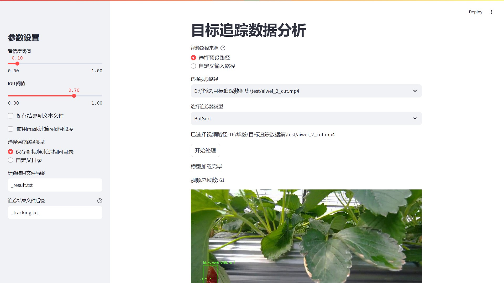

# BoxMOT-hhy: 草莓计数目标跟踪项目

<div align="center">
  <p>
  
  </p>
</div>

## 简介

BoxMOT-hhy 是一个基于 YOLO 和 BOTSORT 的草莓计数目标跟踪项目，目前支持以下功能模块：

- **analyse**：输出结果的分析模块  
- **mask**：与掩码相关的处理模块  
- **log**：日志的读取和保存，用于分析  
- **save_txt_video.py**：使用 YOLO 和 BOTSORT 处理视频，生成追踪结果的 txt 文件  
- **video2txt_mask_reid.py**：逐帧处理视频，生成 txt 结果文件  
- **video2txt_savevideo.py**：逐帧处理视频，生成 txt 结果文件并保存结果视频  
- **track_streamlit.py**：结合 Streamlit 实现可视化前端页面，可选择视频并设置参数进行跟踪  
- **gt2txt.py**：根据真值文件生成追踪结果  

---

## 安装

建议 Python 环境版本为 **3.9 及以上**。

### 如果需要运行 YOLOv8、YOLOv9 或 YOLOv10 示例：

```bash
git clone https://github.com/huanghany/boxmot.git
cd boxmot
pip install poetry
poetry install --with yolo  # 安装 BoxMOT 和 YOLO 相关依赖
poetry shell               # 激活新创建的环境
```

### 如果只需要导入目标跟踪模块：

```bash
pip install boxmot
```

---

## YOLOv8 | YOLOv9 | YOLOv10 示例

### 跟踪模块的使用

#### 选择 YOLO 模型

```bash
python tracking/track.py --yolo-model yolov10n       # 仅边界框
python tracking/track.py --yolo-model yolov9s        # 仅边界框
python tracking/track.py --yolo-model yolov8n        # 仅边界框
python tracking/track.py --yolo-model yolov8n-seg    # 边界框 + 分割掩码
```

#### 选择跟踪算法

```bash
python tracking/track.py --tracking-method deepocsort
                                             strongsort
                                             ocsort
                                             bytetrack
                                             botsort
                                             imprassoc
```

#### 选择跟踪来源

支持多种视频格式：

```bash
python tracking/track.py --source 0                               # 使用摄像头
                                  img.jpg                         # 图像
                                  vid.mp4                         # 视频
                                  path/                           # 文件夹
                                  path/*.jpg 
```

#### 选择 ReID 模型

对于使用外观描述的跟踪方法，可以选择合适的 ReID 模型。模型列表见 [ReID 模型库](https://kaiyangzhou.github.io/deep-person-reid/MODEL_ZOO)。可通过 [reid_export.py](https://github.com/mikel-brostrom/yolo_tracking/blob/master/boxmot/appearance/reid_export.py) 进一步优化模型。

```bash
python tracking/track.py --source 0 --reid-model lmbn_n_cuhk03_d.pt               # 轻量模型
                                                   osnet_x0_25_market1501.pt
                                                   mobilenetv2_x1_4_msmt17.engine
                                                   resnet50_msmt17.onnx
                                                   osnet_x1_0_msmt17.pt
                                                   clip_market1501.pt               # 重量模型
                                                   clip_vehicleid.pt
```

#### 过滤跟踪类别

默认情况下，跟踪器会跟踪所有 MS COCO 数据集的类别。如果只想跟踪特定类别，可以通过 `--classes` 指定类别索引：

```bash
python tracking/track.py --source 0 --yolo-model yolov8s.pt --classes 16 17  # 只跟踪猫和狗
```

MS COCO 数据集的类别和索引见 [类别列表](https://tech.amikelive.com/node-718/what-object-categories-labels-are-in-coco-dataset/)。本项目中的类别索引从 0 开始。

---

### 评估（待修改）

使用以下命令对 MOT 数据集或自定义数据集进行评估：

```bash
python3 tracking/val.py --benchmark MOT17-mini --yolo-model yolov8n.pt --reid-model osnet_x0_25_msmt17.pt --tracking-method deepocsort --verbose --source ./assets/MOT17-mini/train
python3 tracking/val.py --benchmark MOT17      --yolo-model yolov8n.pt --reid-model osnet_x0_25_msmt17.pt --tracking-method ocsort     --verbose --source ./tracking/val_utils/MOT17/train
```

评估过程中，检测结果和嵌入结果会分别存储，后续可用于任意跟踪算法，避免重复生成。


---

## 联系方式

对于本仓库的的 Bug 和功能需求，请访问 [GitHub Issues](https://github.com/huanghany/boxmot/issues)。  
对于商务或技术支持，请发送邮件至：huanghanyang345@163.com。

**目标检测部分来源**：[https://github.com/ultralytics/ultralytics](https://github.com/ultralytics/ultralytics)  
